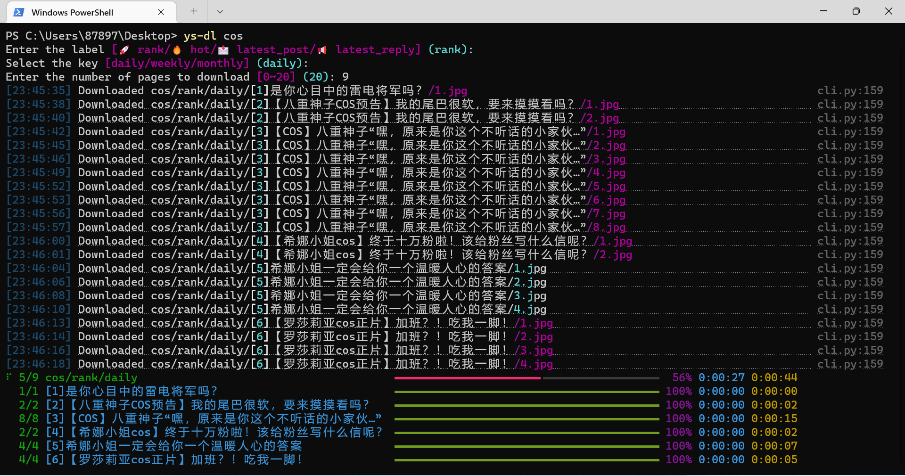

# ys-dl

Command-line program to download images from [Genshin Impact Community](https://ys.mihoyo.com/).


[](https://www.codacy.com/gh/XavierJiezou/ys-dl/dashboard?utm_source=github.com&utm_medium=referral&utm_content=XavierJiezou/ys-dl&utm_campaign=Badge_Grade)
[](https://codecov.io/gh/XavierJiezou/ys-dl)


[](https://github.com/XavierJiezou/ys-dl/stargazers)
[](https://github.com/XavierJiezou/ys-dl/network)
[](https://github.com/XavierJiezou/ys-dl/issues)
[](https://github.com/XavierJiezou/ys-dl/blob/main/LICENSE)

## Demo



## Features

- [x] Download icon image.
- [x] Download background image.
- [x] Download cosplay image.
- [x] Download fan works image.
- [x] Download ranking images.
- [ ] Downlaod topic images.

## Install

```bash
pip install ys-dl
```

## Usage

`$ ys-dl`

- Download cosplay images

```bash
ys-dl cos
```

- Download fan works images

```bash
ys-dl fan
```

- Download ranking images.

```bash
ys-dl rank
```

## Changelog

See [CHANGELOG.md](CHANGELOG.md)

## License

[MIT License](License)

## References

[](https://github.com/python-poetry/poetry)
[](https://github.com/SeleniumHQ/selenium)
[](https://github.com/psf/requests)
[](https://github.com/Textualize/rich)
[](https://github.com/google/python-fire)
[](https://github.com/pytest-dev/pytest)
